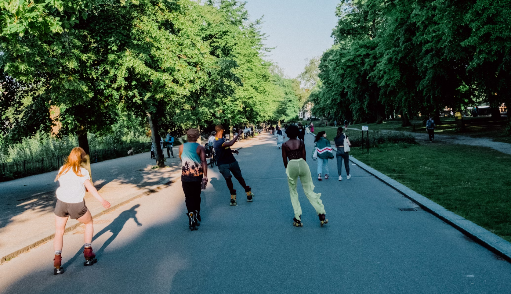

# 🛼 Snitap - Landing Page com CSS Animations

<div align="center">
  
  
  
  <br/>
  <br/>
  
  [](https://developer.mozilla.org/en-US/docs/Web/HTML)
  [](https://developer.mozilla.org/en-US/docs/Web/CSS)
  
  
  
  **Landing page moderna de patins com foco em animações CSS puras e design responsivo.**
  
  <br/>
  
  [🔗 Ver Demo ao Vivo](#) | [📧 Contato](mailto:junioralmeidati2023@gmail.com)
  
</div>

## 📋 Sobre o Projeto

Este é o **Snitap**, uma landing page de produtos desenvolvida como projeto da [Rocketseat](https://www.rocketseat.com.br/) com o objetivo de consolidar conhecimentos em **CSS Animations puras**.

O projeto explora técnicas avançadas de animação sem JavaScript, criando uma experiência visual fluida e moderna usando apenas HTML e CSS. A landing page apresenta patins da marca Snitap com uma interface dinâmica e interativa.

### ✨ Características principais

- 🎬 **Animações CSS puras** - Keyframes, transitions e transforms sem JavaScript
- 🎨 **Design moderno** - Interface clean e profissional
- 🔄 **Banner infinito** - Scroll contínuo com efeito de rolagem infinita
- 📱 **Totalmente responsivo** - Adaptado para mobile (375px) e desktop (1024px+)
- 🌈 **Efeitos de hover** - Interações suaves e feedback visual
- 🎯 **Galeria dinâmica** - Grid de fotos com animações de entrada

## 🛠️ Tecnologias Utilizadas

- **HTML5** - Estrutura semântica com tags modernas
- **CSS3** - Animações, Grid, Flexbox e Custom Properties
- **Google Fonts** - Tipografia (Montserrat, Syne)
- **CSS Animations** - Keyframes para animações complexas
- **CSS Transitions** - Transições suaves entre estados
- **CSS Custom Properties** - Variáveis para design system
- **CSS Nesting** - Aninhamento nativo (Chrome 112+, Safari 16.5+, Firefox 117+)
- **CSS Line Height Units (lh)** - Unidade relativa à altura da linha (Chrome 115+)
- **Media Queries** - Responsividade desktop-first (@media max-width)

## 🎯 Funcionalidades Implementadas

**Header:**
- Header minimalista com ícones flutuantes
- Animação de rotação no hover dos ícones
- Indicador de quantidade no carrinho

**Hero Section:**
- Título com palavras que alternam em loop infinito
- Botões de CTA com efeitos de hover
- Composição visual com múltiplas camadas de imagens

**Banner Animado:**
- Scroll infinito contínuo de ícones
- Animação de gradiente em movimento
- Loop perfeito sem quebras visuais

**Galeria:**
- Grid responsivo de fotos
- Animações de entrada escalonadas
- Figcaption com informações do usuário

**Footer:**
- Links de navegação organizados
- Integração com redes sociais
- Design consistente com o restante da página

## 📱 Responsividade

**Abordagem Desktop-First:**

O projeto foi desenvolvido inicialmente para desktop (1024px+) e adaptado para mobile (≤768px) utilizando media queries, mantendo compatibilidade total entre as versões.

**Breakpoint principal:**
- `@media (max-width: 768px)` - Mobile e tablets

**Adaptações mobile implementadas:**

**Header:**
- Padding ajustado para 24px lateral
- Ícones mantêm interatividade e animações

**Hero Section:**
- Layout vertical com `flex-direction: column-reverse`
- Imagem do patins no topo, título e botões abaixo
- Título reduzido para 1.90rem (cabe em 2 linhas)
- Animação das palavras adaptada com keyframes mobile (`slideUP-mobile-bounce`)
- Botões empilhados verticalmente (VEJA EM AÇÃO → COMPRAR AGORA)
- Container de imagens reduzido de 488px → 312px
- Stars reposicionadas para proporções mobile

**Banner:**
- Padding reduzido para melhor aproveitamento de espaço
- Animação de scroll infinito mantida

**Galeria:**
- Grid 2×2 desktop → Coluna única mobile (empilhado)
- Imagens fixas em 312px × 256px
- Border-radius ajustado
- Animações de entrada e hover mantidas
- Efeito de zoom preservado

**Footer:**
- Layout horizontal → vertical (empilhado)
- Logo e nav alinhados à esquerda
- Links de navegação empilhados
- Social links centralizados
- Altura adaptativa (auto)

**Técnicas CSS utilizadas:**
- `flex-direction: column-reverse` para inversão de ordem
- `order` para reordenação de botões
- Unidade `1lh` (line-height) para animações responsivas
- `max-width` + `margin-inline: auto` para centralização
- Custom properties (`--step`) para animações escaláveis
- Position absolute com valores recalculados para mobile

## 🌐 Compatibilidade de Navegadores

**Tecnologias modernas utilizadas:**

| Recurso | Chrome | Safari | Firefox | Edge |
|---------|--------|--------|---------|------|
| CSS Nesting | 112+ | 16.5+ | 117+ | 112+ |
| Line Height Units (lh) | 115+ | 16.4+ | 120+ | 115+ |
| Animation Timeline (view) | 115+ | 17.4+ | 🚫 | 115+ |
| CSS Custom Properties | ✅ | ✅ | ✅ | ✅ |
| Flexbox & Grid | ✅ | ✅ | ✅ | ✅ |

**Recomendação:** Use versões atualizadas dos navegadores para melhor experiência.

## 🚀 Como Executar

Clone o repositório e abra o arquivo HTML:

```bash
# Clone o repositório
git clone https://github.com/juninalmeida/rollmotionanimation.git
cd rollmotionanimation

# Abra o index.html no navegador
# Ou use um servidor local:
python -m http.server 8000
# Acesse: http://localhost:8000
```

Não há dependências ou build - é HTML e CSS puro!

## 📁 Estrutura do Projeto

```
rollmotionanimation/
├── 📁 assets/
│   ├── 📁 hero/              # Imagens da hero section
│   ├── 📁 icons/             # Ícones SVG
│   └── 📁 images/            # Galeria e recursos
├── 📁 styles/
│   ├── global.css            # Reset, variáveis e estilos base
│   ├── header.css            # Estilos do header
│   ├── hero.css              # Hero section e animações
│   ├── banner.css            # Banner com scroll infinito
│   ├── gallery.css           # Grid da galeria
│   ├── footer.css            # Rodapé
│   └── index.css             # Arquivo central de imports
├── index.html                # Página principal
└── README.md                 # Documentação
```

## 🎨 Paleta de Cores

**Cores principais:**
- Amarelo `#FFCD1E` (Snitap Sun) - Elementos de destaque
- Azul Céu `#06B6D4` (Sky Mid) - Gradientes e destaques
- Azul Claro `#67E8F9` (Sky Light) - Variações
- Rosa `#DB2777` (Joy Mid) - Acentos
- Verde `#16A34A` (Leaf Mid) - Call-to-actions

**Cores de sistema:**
- Texto: `#000000`
- Background: `#FAFAFA`

## 🎬 Animações Implementadas

**Principais animações:**
- ✨ Rotação de ícones no hover (transform + transition)
- 🔄 Loop infinito de palavras alternadas (keyframes)
- 📜 Scroll contínuo do banner (animation + translate)
- 🌈 Gradiente animado em movimento (keyframes + background)
- 📸 Entrada escalonada de cards da galeria (animation-delay)

## 💡 Aprendizados Técnicos

Este projeto me ajudou a consolidar:
- Criação de animações complexas com `@keyframes`
- Uso estratégico de `animation-delay` para efeitos escalonados
- Técnicas de scroll infinito com CSS puro
- Otimização de performance em animações
- Arquitetura CSS modular e escalável
- Design system com Custom Properties
- Semântica HTML5 correta
- **Responsividade Desktop-First** com media queries
- **Adaptação de layouts** com Flexbox (column-reverse, order)
- **Animações responsivas** usando unidades relativas (lh, rem)
- **Reposicionamento** de elementos com position absolute em diferentes viewports
- **Debugging sistemático** com DevTools (Computed, Layout, Box Model)

## 👨‍💻 Desenvolvedor

<div align="center">
  
  
  <h3>Horacio Junior</h3>
  
  <p>Desenvolvedor Full Stack em formação</p>
  
  [](https://github.com/juninalmeida)
  [](https://www.linkedin.com/in/júnior-almeida-3563a934b/)
  [](mailto:junioralmeidati2023@gmail.com)
  
  <br/>
  
  <p>Estudante de desenvolvimento focado em criar interfaces modernas e funcionais.<br/>Este projeto faz parte da minha jornada de aprendizado em front-end e CSS avançado.</p>
  
  <br/>
  
  
  
</div>

## 🙏 Créditos

- **Rocketseat** - Projeto e design original
- **Google Fonts** - Tipografia (Montserrat e Syne)
- **Comunidade CSS** - Técnicas e inspirações de animação

---

<div align="center">
  <p>Desenvolvido com foco em CSS Animations 🎬</p>
  <p>⭐ Se este projeto te ajudou, deixe uma estrela!</p>
</div>

